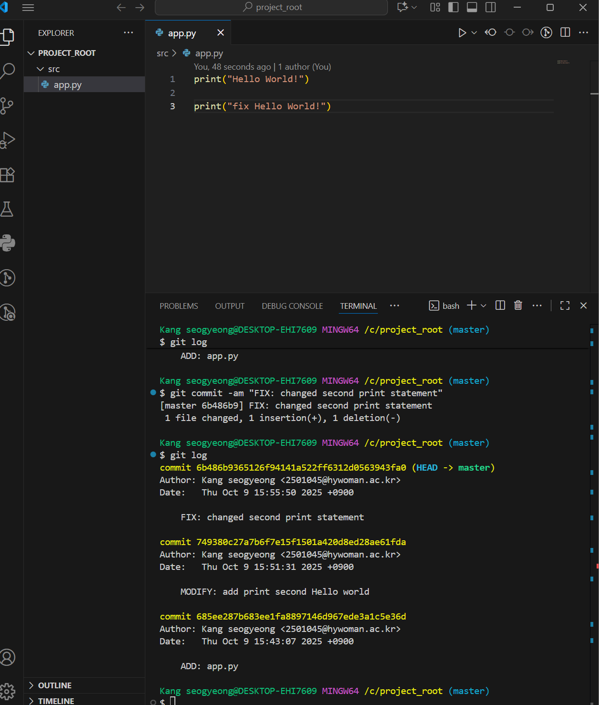
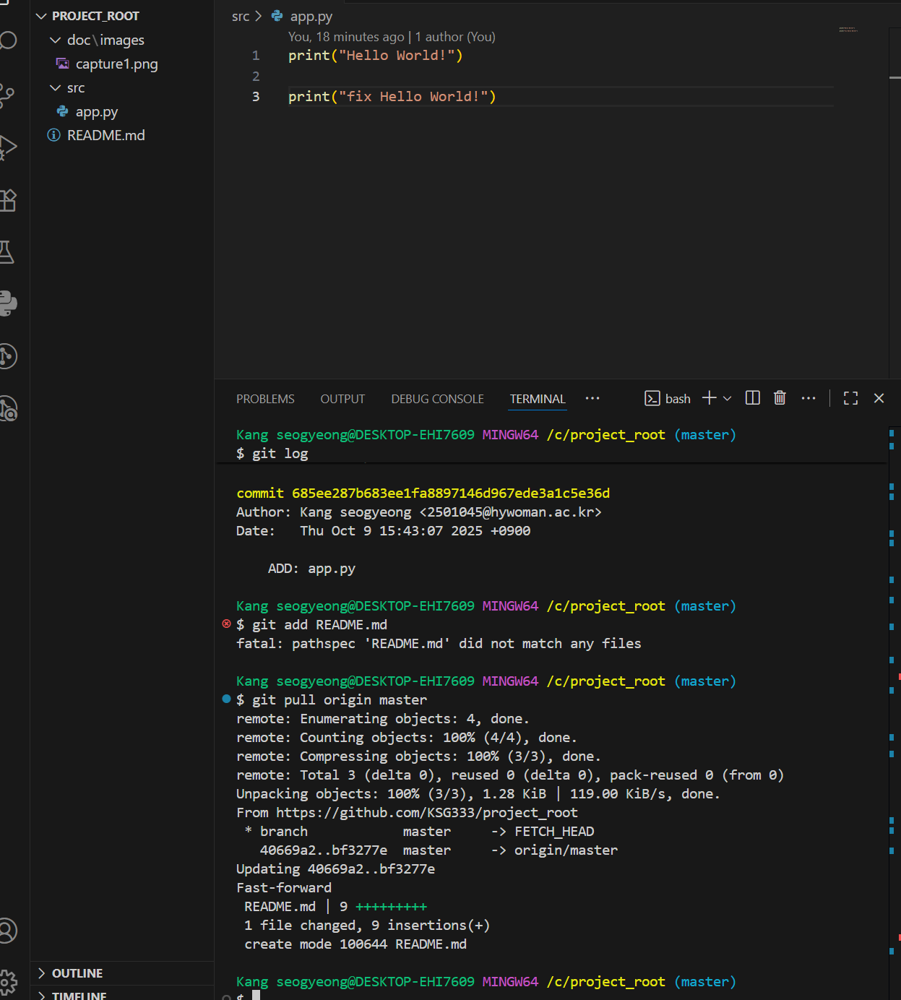

# Python GitHub 과제

## 1. 과제 개요
- VS Code에서 Python 프로젝트를 생성하고 Git/GitHub을 활용하여 버전 관리 및 저장소 연동을 실습한다.  
- commit 메시지 규칙:  
  - 첫 번째: `ADD: ...`  
  - 이후 기능 추가: `MODIFY: ...`  
  - 코드 수정: `FIX: ...`  

---

## 2. 프로젝트 폴더 구조
```
project_root/
 ├─ src/
 │   └─ app.py
 ├─ doc/
 │   └─ images/
 │       ├─ capture1.png
 │       └─ capture2.png
 └─ README.md
```

---

## 3. 수행 과정
1. **src/app.py 작성 및 첫 commit**
   - commit 메시지: `ADD: app.py`  
   - 기능: [print("Hello World!")]  

2. **두 번째 commit**
   - commit 메시지: `MODIFY: ~` 또는 `FIX: ~`  
   - 수정/추가한 내용: [print("second Hello World!" 추가)]  

3. **세 번째 commit**
   - commit 메시지: `MODIFY: ~` 또는 `FIX: ~`  
   - 수정/추가한 내용: [print("fix Hello World!")   "second Hello World!"를 수정함]  

---

## 4. 캡처 이미지
- `capture1.png` → commit 완료 상태 화면  
- `capture2.png` → GitHub push → pull 후 VS Code 화면  

예시:  
  
  

---

## 5. GitHub Repository URL
- URL: [https://github.com/KSG333/project_root/tree/master]  

---

## 6. 느낀 점 (선택 사항)
- 이번 과제를 하면서 배운 점: git/github는 회사생활 혹은 학교생활에서 자주 사용하기에 자세하게 알아야 한다는 것을 인지하고 있는 상태에서 수업을 듣고 있지만, 내용이 다소 어려운 편이여서 앞으로의 학교생활이나 직장생활에서 능숙하게 활용하기 위해 더 깊이 있는 학습이 필요함을 깨닫는 계기가 되었습니다.
- Git/GitHub을 활용하며 어려웠던 점:  방법이 어려운 것 같다. 단순 커밋은 익숙하지만 원격 저장소(Repository)에 변경 사항을 반영하는 push/pull 사용방법은 아직 어려운 것 같다.
- 앞으로 더 해보고 싶은 것:  전문가처럼 능숙하고 안정적으로 버전을 관리하고 협업하는 능력을 갖추고 싶습니다.
